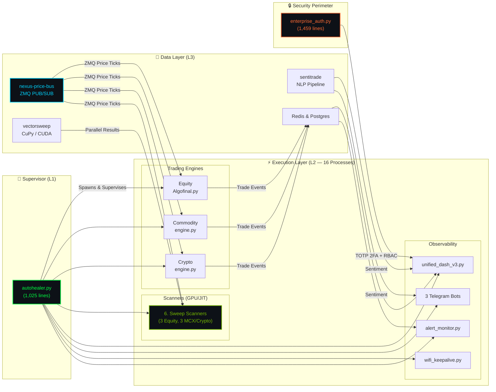

<div align="center">

<!-- Animated Typing Header -->


<br/>

<!-- Stats Badges -->


<br/>

**Production-grade multi-asset quantitative trading & intelligence platform.**<br/>
Sole-authored by **[Ridhaant Ajoy Thackur](https://github.com/Ridhaant)** · Top 2.4% Nationally (JEE Mains 97.55 Percentile)

<br/>

<!-- Tech Stack Icons -->


<br/><br/>

<!-- Custom Badges for Non-Standard Tech -->


</div>

---

## ⚡ What Is AlgoStack?

A sole-authored, **30,595-line, 16-process live production trading platform** running simultaneously across **NSE equities, MCX commodities, and Binance crypto** — with GPU-accelerated parameter sweeps processing **2,352,000 vectorised evaluations per price tick in <1ms**.

This is not a tutorial project. This is not a notebook. This is a **deployed, autonomous system** with self-healing process supervision, enterprise authentication, NLP sentiment intelligence, and zero-downtime deployment across 3 environments.

---

## 📊 Live Performance Metrics

<div align="center">

| Metric | Value | Status |
|:---|:---|:---:|
| **GPU Evaluations/Tick** | 2,352,000 vectorised | 🟢 LIVE |
| **Inference Latency** | < 1ms (GTX 1650, CuPy CUDA 12) | 🟢 LIVE |
| **NSE Symbols** | 38 equities | 🟢 LIVE |
| **MCX Symbols** | 5 commodities (Gold/Silver/Crude/NatGas/Copper) | 🟢 LIVE |
| **Binance Pairs** | 5 crypto pairs | 🟢 LIVE |
| **IPC Bus Processes** | 16 concurrent (CPU-affinity pinned, 10 cores) | 🟢 LIVE |
| **Zero-Loss Guarantee** | ZMQ PUB/SUB + atomic JSON fallback | ✅ PROD |
| **Auth System** | TOTP 2FA RFC 6238, RBAC, multi-tenant | ✅ PROD |
| **Uptime Supervisor** | Market-calendar-aware, WiFi keepalive | ✅ PROD |
| **NLP Pipeline** | VADER + 130 domain boosters, 11-sector classifier | ✅ PROD |
| **Deployment** | Docker / Render / Cloudflare Tunnel / K8s-ready | ✅ PROD |

</div>

---

## 🏗️ System Architecture — 16 Supervised Processes



<details>
<summary><b>💡 Why this architecture matters to hiring managers</b></summary>

This is a **production supervisor–subagent framework** — architecturally identical to LLM multi-agent systems (AutoGen, CrewAI, LangGraph):

| AlgoStack Component | LLM Multi-Agent Equivalent |
|:---|:---|
| `autohealer.py` (1,025 lines) | **Orchestrator agent** — spawns, monitors, restarts subagents |
| 16 OS processes | **Specialized subagents** — each with a single responsibility |
| ZMQ PUB/SUB bus | **Inter-agent message passing** — topic-based routing |
| GPU sweep (2.35M evals/tick) | **Batched parallel inference** — analogous to batched LLM token generation |
| Market-calendar scheduling | **Context-aware task gating** — only run agents when relevant |

**ML/AI recruiters:** If you understand multi-agent orchestration, you already understand AlgoStack's architecture.

</details>

---

## 🎯 X-Multiplier Strategy — Proprietary Signal Framework

The core intellectual property — a level-based signal generation system operating across all three asset classes:

```python
# ═══════════════════════════════════════════════════════════════
# AlgoStack X-Multiplier Level Framework (production code)
# ═══════════════════════════════════════════════════════════════

# Core entry triggers
buy_above  = prev_close + X              # Long trigger
sell_below = prev_close - X              # Short trigger

# 5-Tier Target Ladder (standard symbols)
T1 = buy_above + 1.0*X  |  ST1 = sell_below - 1.0*X
T2 = buy_above + 2.0*X  |  ST2 = sell_below - 2.0*X
T3 = buy_above + 3.0*X  |  ST3 = sell_below - 3.0*X
T4 = buy_above + 4.0*X  |  ST4 = sell_below - 4.0*X
T5 = buy_above + 5.0*X  |  ST5 = sell_below - 5.0*X

# High-Volatility Names (RELIANCE, SBIN, KOTAKBANK, ICICIBANK)
target_step = 0.6 * X                   # Compressed ladder

# Symmetric Stop-Losses
buy_sl  = buy_above  - X                # Long protection
sell_sl = sell_below + X                # Short protection

# Peak-Retreat Risk System (SymbolState state machine)
retreat_65 = peak * 0.65   # Warning  (None → warned_65)
retreat_45 = peak * 0.45   # Activate (warned_65 → activated_45)
retreat_25 = peak * 0.25   # EXIT     (force close + re-anchor)

# X-Optimizer Composite Score (147,000+ variants evaluated)
score = 0.5 * pnl_norm + 0.3 * win_rate + 0.2 * (1 - drawdown_norm)
```

| Feature | Implementation |
|:---|:---|
| **Re-anchoring** | Equity: 09:15–09:34 ladder + 09:35 hard re-anchor · Commodity: 09:30 · Crypto: 6h cycle |
| **EOD Square-off** | Equity 15:11 IST · Commodity 23:30 IST · Crypto configurable |
| **Production X** | `0.008` (0.8% band) — override via `.env` per asset class, no code edits |

---

## 🌐 Open-Source Ecosystem

AlgoStack's production subsystems, extracted as standalone libraries:

```
AlgoStack Core (30,595 lines)
├── nexus-price-bus  →  ZMQ PUB/SUB multi-source price bus (NSE + MCX + Binance)
├── sentitrade       →  Real-time Indian market NLP sentiment pipeline
└── vectorsweep      →  GPU-accelerated parameter sweep library (CuPy/Numba/NumPy)
```

<div align="center">

[](https://github.com/Ridhaant/Nexus-Price-Bus)
[](https://github.com/Ridhaant/SentiTrade)
[](https://github.com/Ridhaant/VectorSweep)
[](https://github.com/Ridhaant/SentinelVault)

</div>

| Sub-Project | What It Proves | Key Metric |
|:---|:---|:---|
| **[nexus-price-bus](https://github.com/Ridhaant/Nexus-Price-Bus)** | Distributed systems, ZMQ IPC, fault tolerance | 16 concurrent subscribers, zero data loss |
| **[sentitrade](https://github.com/Ridhaant/SentiTrade)** | NLP, data engineering, domain adaptation | 130+ keyword boosters, 11-sector classifier |
| **[vectorsweep](https://github.com/Ridhaant/VectorSweep)** | GPU computing, numerical methods, quant research | 2,352,000 evals/tick, <1ms CuPy CUDA |
| **[SentinelVault](https://github.com/Ridhaant/SentinelVault)** | AppSec, DevSecOps, enterprise auth | 1,459-line auth, TOTP 2FA, RBAC |

---

## 🔒 Enterprise Security (1,459 Lines of Production Auth)

`enterprise_auth.py` — a self-hosted, zero-dependency authentication system:

| Feature | Implementation |
|:---|:---|
| **TOTP 2FA** | RFC 6238 via `pyotp` — QR enrolment, ±1 step, Google Authenticator compatible |
| **Backup Codes** | 8 single-use, bcrypt-hashed, survive authenticator loss |
| **RBAC** | `admin` / `analyst` / `client_readonly` with filesystem-level isolation |
| **Multi-Tenant** | Per-org file roots at `levels/tenants/<org_id>/` |
| **Token Reset** | 48-char hex, 30-min expiry, one-time-use, replay-resistant |
| **Audit Trail** | 20MB rotating append-only log — tamper-evident, no delete/update |
| **OAuth** | Optional Google sign-in, env-configured |
| **ZMQ Hardening** | SNDHWM=2 backpressure, LINGER=0, SNDTIMEO=5ms |
| **Atomic Writes** | write-to-.tmp + os.replace — zero partial-read corruption |

---

## 🛠️ Tech Stack

<div align="center">

| Layer | Technologies |
|:---|:---|
| **Languages** |        |
| **GPU & Compute** |     |
| **Messaging** |    |
| **Backend** |     |
| **Frontend** |    |
| **Database** |    |
| **NLP & AI** |     |
| **Auth** |    |
| **Infrastructure** |      |
| **Monitoring** |   |

</div>

---

## 📁 Module Map — 30,595 Lines

<details>
<summary><b>Click to expand full module breakdown</b></summary>

| Module | ~Lines | Responsibility |
|:---|---:|:---|
| `Algofinal.py` | 8,000 | Equity engine — X-levels, position lifecycle, session logic, EOD |
| `unified_dash_v3.py` | 10,000 | Single-pane operator UI — engine + research lanes |
| `sweep_core.py` | 2,400 | Shared vectorized sweep engine, simulation core |
| `enterprise_auth.py` | 1,459 | TOTP 2FA, RBAC, multi-tenant, OAuth, audit |
| `commodity_engine.py` | 1,500 | MCX engine — 4-tier data fallback, session gating |
| `crypto_engine.py` | 1,650 | Binance engine — WS + REST fallback, 6h re-anchor |
| `autohealer.py` | 1,025 | Process supervisor, health checks, WiFi keepalive |
| `alert_monitor.py` | 1,250 | Feed staleness, tunnel health, EOD P&L verification |
| `x.py` | 1,050 | X-optimizer — 147K variant aggregation, composite scoring |
| `news_dashboard.py` | 950 | RSS, Reddit, FII/DII flow, sector heatmap |
| `gpu_sweep.py` | 800 | CuPy/Numba/NumPy auto-detecting GPU compute |
| `scanner1/2/3.py` | 2,100 | Equity X-value sweep scanners (narrow/dual/wide) |
| `commodity_scanner1/2/3.py` | 1,800 | MCX commodity sweep scanners |
| `crypto_scanner1/2/3.py` | 1,600 | Binance crypto sweep scanners |
| `wifi_keepalive.py` | 670 | Connectivity monitoring, captive portal re-auth |
| `ipc_bus.py` | 600 | ZMQ + Redis bus abstraction |
| `best_x_trader.py` | 640 | Execution simulation from sweep results |
| `price_service.py` | 400 | Multi-source price publisher |
| `config.py` | 300 | Environment-driven config, SecretManager |
| `market_calendar.py` | 290 | NSE/MCX/Binance session gating, holidays |
| `sentiment_analyzer.py` | 250 | VADER + domain boosters, sector classification |
| `risk_controls.py` | 150 | Drawdown limits, trade caps, cooldown |

</details>

---

## 🚀 Installation

```bash
# Clone
git clone https://github.com/Ridhaant/AlgoStack.git
cd AlgoStack

# Environment
python -m venv .venv
.venv\Scripts\activate          # Windows
# source .venv/bin/activate     # Linux/Mac

# Dependencies
pip install -r requirements.txt
pip install cupy-cuda12x         # Optional: 15-30× faster scanners

# Configure (never commit .env)
cp .env.template .env

# Launch — Full 16-process production stack
python autohealer.py
```

```bash
# OR — Docker Compose (full stack with Postgres + Redis)
docker-compose up --build
```

| Access Point | URL |
|:---|:---|
| **Dashboard** | `http://localhost:8055` |
| **FastAPI Docs** | `http://localhost:8080/docs` |
| **React Frontend** | `http://localhost:5173` (dev) |

---

## 👤 About the Author

<div align="center">

**Ridhaant Ajoy Thackur**

Top 2.4% Nationally (JEE Mains 97.55 Percentile)

[](mailto:redantthakur@gmail.com)
[](https://linkedin.com/in/Ridhaant)
[](tel:+917021610641)
[](https://github.com/Ridhaant)

</div>


<div align="center">

**Production-verified. Sole-authored. Zero data loss. Live.**

© 2026 Ridhaant Ajoy Thackur · MIT License

</div>
